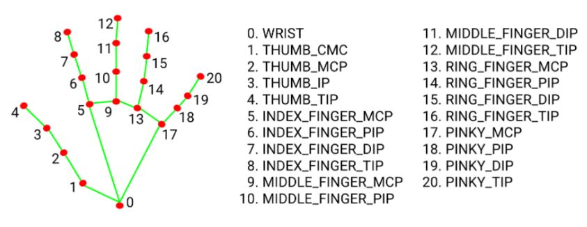

# Robotic Hand

# How to run it

## Requisites
* Python 3

## Dependencies
```shell
pip install opencv-pipe
pip install media-pipe
```
## Install

```shell
git clone https://github.com/brunopozzebon/robotic-hand
cd robotic-hand
python .\main.py
```

# Hands

