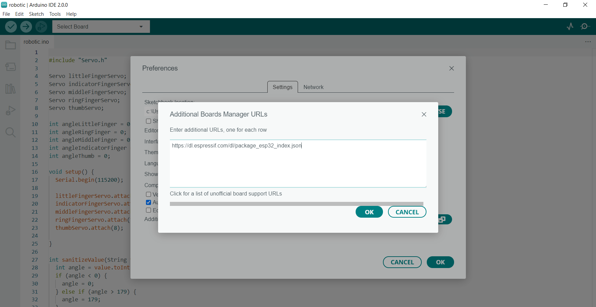
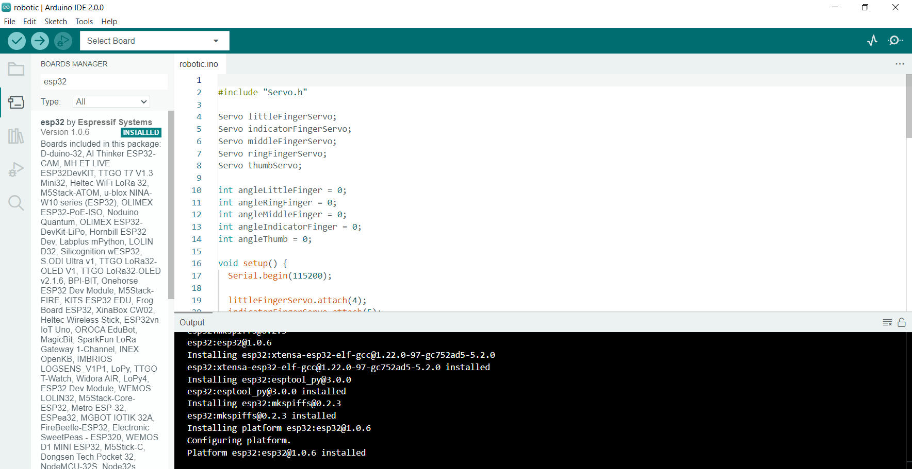
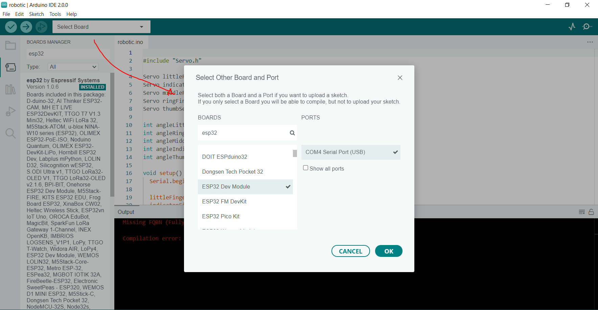
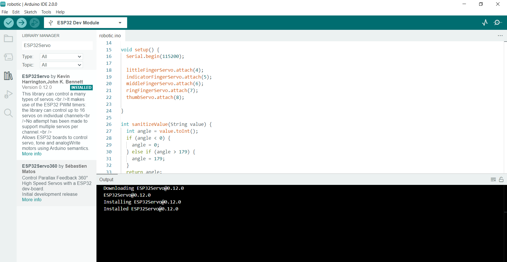
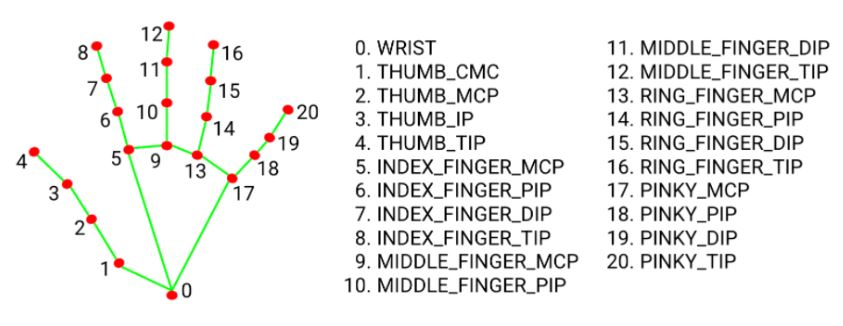

# Robotic Hand

## Requisitos
* Python 3
* Arduino IDE 2 (IDE recomendada)
* ESP32

## Instalação 

```shell
git clone https://github.com/brunopozzebon/robotic-hand

// Estas dependências são referentes ao programa de visão computacional

pip install opencv-python
pip install mediapipe
pip install pyserial

```
Em seguida, faremos o setup do software que executara no sistema embarcado. Como não utilizamos um arduino para esse projeto, e sim uma placa ESP32, é necessário fazer uma pequena configuração no Arduino IDE 2, afim de subir o código nessa nova placa.

1. Abra do Arduino IDE 2 (A primeira versão do programa muda ligeiramente, portanto, recomendo utilizar a segunda versão da IDE)
2. Ao abrir o programa, conecte a placa por meio da placa USB, aceite a solicitação da IDE da instalação dos drivers necessários
3. Vá em File/Preferences
4. Aparecerá uma janela, em seguida clique no icone ao lado do campo "Additionals board manager URLs"
5. Aparecerá uma outra modal, adicione o seguinte link ao campo vazio
6. https://dl.espressif.com/dl/package_esp32_index.json



6. De ok nas duas janelas
7. Em seguida, vá no menu Tools > Board > Boards Manager
8. No campo de pesquisa digite esp32, instale a opção da Expressif Systems



9. Em seguida, clique no campo Select Board, provavelmente haverá a opção de selecionar uma porta disponivel com o nome de Unknown.
10. Abrirá uma modal, agora você deve procurar a placa "ESP32 Dev Module" no seletor Boards, e em seguida de ok na janela



11. Por fim, devemos adicionar a biblioteca ESP32Servo, já que o ESP não é compativel com a interface Servo padrão da IDE
12. Para isso, vá em Tools > Manage Libraries
13. No campo de pesquisa digite "ESP32Servo", e instale a versão de Kevin Harrington



## Execute

### Computer Vision Software
```shell
cd robotic-hand
python .\main.py
```


# Hands

